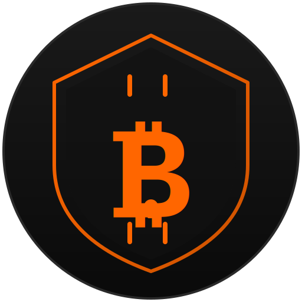

<p align="center">
  
</p>

<h1 align="center">Sovereign Wallet</h1>
<h3 align="center">The browser wallet Samourai never built.</h3>

[](https://opensource.org/licenses/MIT) []() []()

---

## Why this exists

Samourai Wallet was the most advanced Bitcoin privacy wallet ever built. Real coin control, real CoinJoin, real post-mix spending tools. Nothing else came close.

In April 2024, its founders were arrested and the servers were seized. The code was open source, but nobody finished porting it to the browser. The Android app died with its infrastructure. Millions of sats worth of privacy tooling just... stopped.

Sovereign Wallet picks up where Samourai left off. Same privacy philosophy. Same uncompromising approach to coin control. But this time it connects to YOUR node. No company. No central servers. No single point of failure.

If we get arrested tomorrow, you can still run this from source.

---

## What it does

| Feature | What | Why it matters |
|---|---|---|
| **HD Wallet (BIP84)** | 24-word mnemonic seed, native SegWit addresses | Industry standard. Your keys, your coins. Works with any recovery tool. |
| **Connect to YOUR node** | Fulcrum or Electrum Server support | Your transactions never touch our infrastructure. Nobody builds a profile of your wallet. |
| **Stonewall** | High-entropy transactions that look like CoinJoin | Confuses chain analysis without needing a counterparty. Every spend looks like a collaborative transaction. |
| **Ricochet** | Intermediate hops before your payment arrives | Adds distance between your UTXO history and the final recipient. Makes "tainted coin" flags irrelevant. |
| **Coin Control** | Manual UTXO selection for every transaction | You decide which coins to spend. No algorithm merging your anonymous and KYC coins behind your back. |
| **Privacy Score** | Real-time analysis before you broadcast | See exactly what a transaction reveals BEFORE you send it. Entropy, address reuse, change detection, cluster risk. |
| **UTXO Map** | Visual graph of your coin history | Understand your wallet's on-chain footprint at a glance. See which coins are linked, which are isolated. |
| **Silent Payments (BIP352)** | Static address that generates unique on-chain addresses | The biggest on-chain privacy improvement since Taproot. Share one address publicly, receive to unique addresses every time. No interaction required. |
| **PayNyms (BIP47)** | Reusable payment codes | Send to the same person repeatedly without reusing addresses. No server coordination needed. |
| **Family Node** | Invite friends/family to your node via QR code | Onboard people to Bitcoin privacy without making them run their own node. One QR code, done. |
| **AI Privacy Advisor** | Plain language transaction analysis | Not everyone reads hex. The advisor tells you in plain English what each transaction reveals and what you can do about it. |

---

## Privacy levels

| Option | Who sees your addresses | Best for |
|---|---|---|
| Your own node | Nobody | Maximum privacy |
| Developer node | Only the developer | Quick start |
| Blockstream | Blockstream Inc. | Testing only |
| mempool.space | mempool.space | Testing only |
| Custom | Depends on the node | Advanced users |

> Your private keys never leave your device regardless of which node you use.

---

## Run your own node

You need:
- A dedicated machine: Intel NUC, old PC, or Raspberry Pi 5
- 1TB+ SSD (NVMe preferred)
- Ubuntu 24.04 LTS

Full step-by-step instructions in [`docs/SETUP_NUC.md`](docs/SETUP_NUC.md).

Bitcoin Core initial sync takes 12-18 hours on decent hardware. After that, Fulcrum indexes in 4-8 hours. Then you're fully sovereign.

---

## Install

```bash
git clone https://github.com/nicacripto/sovereign-wallet.git
cd sovereign-wallet
npm install
cp .env.example .env
npm run build
```

Then load the `dist/` folder in Chrome:
1. Go to `chrome://extensions`
2. Enable Developer Mode
3. Click "Load unpacked"
4. Select the `dist/` folder

---

## Don't want to run your own node?

Running a full node requires time and hardware. If you want privacy benefits without the setup, we offer node access as a service. Your wallet. Your keys. Our infrastructure.

Details at: **sovereign-wallet.dev** (coming soon)

---

## Support the project

If Sovereign Wallet saves you from a privacy mistake, consider sending a few sats. This project has no investors, no company, no plans to have either.

**Bitcoin:** `bc1qlwgnpsxxr7smmu880g26hfdzyrcd8egrqm0j8c`

**Lightning:** `peppyfortune074@walletofsatoshi.com`

---

## Roadmap

| When | What |
|---|---|
| **Q2 2026** | Silent Payments receive (full BIP352 support) |
| **Q3 2026** | Mobile companion app (Android) |
| **Q4 2026** | CoinJoin via Joinstr/Nostr — no central coordinator |
| **2027** | Hardware wallet integration (Coldcard, Ledger, Trezor) |

---

## Why "Sovereign"

In Bitcoin, sovereignty means one thing: nobody can stop you from transacting. Not a company, not a government, not a service provider. Your keys, your node, your rules. That's not a slogan — it's an architecture decision. Every piece of Sovereign Wallet is designed so that no single entity can shut it down, censor it, or surveil it.

This project exists because Samourai proved that privacy tools built on centralized infrastructure have a single point of failure: the people who run them. The founders built incredible technology, but the server dependency meant that when they were taken down, every user lost access. We learned that lesson. Sovereign Wallet has no servers to seize, no company to subpoena, no founder whose arrest kills the project.

The philosophy is simple. No company. No VC money. No token. No roadmap driven by investor returns. The code is open. Fork it. Run it. Modify it. Deploy it on your own domain. Sovereign Wallet is a tool, not a product. If it helps you transact privately, it did its job. If we disappear tomorrow, the code doesn't.

---

## Contributing

See [CONTRIBUTING.md](CONTRIBUTING.md) for guidelines on reporting bugs, proposing features, and submitting pull requests.

## License

MIT. Code is law. Fork freely.
